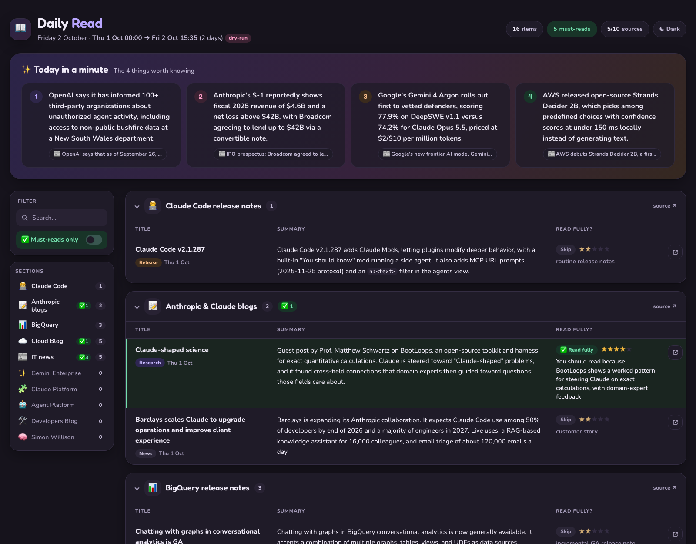

# Daily Read

A local, private daily reading digest. Every morning it fetches the sources you follow (release notes, blogs,
curated reading lists, IT news), has Claude write short neutral summaries and decide what is actually worth
reading in full, and opens a single self-contained HTML report in your browser.

- **100% local**: Python fetches everything; Claude only sees the fetched text. No server, no database.
- **Runs on your Claude subscription** through headless Claude Code (`claude -p`). No API key needed.
- **Strict about your time**: every item gets 1–5★; only 4–5★ items are marked *Read fully*, with a daily budget
  of about 3 must-reads (enforced in code). Everything else is one 300-character summary.
- **One row per item**: each release note, version, post and reading-list link gets its own row.
- **Top IT news**: 5–10 deduplicated industry stories, at most 2 per company.



## Requirements

- macOS (report opening and the planned launchd automation are macOS-specific; the pipeline itself is plain Python)
- [uv](https://docs.astral.sh/uv/) (installs Python 3.12+ and dependencies)
- [Claude Code](https://docs.claude.com/en/docs/claude-code) installed and logged in (`claude` on your `PATH`,
  default `~/.local/bin/claude`; change `claude.bin` in `config.yaml` otherwise)
- Google Chrome (or set `output.browser_app` in `config.yaml`)

## Log in to Claude (one time)

Daily Read doesn't call the Anthropic API directly. It runs **Claude Code in headless mode** (`claude -p`), so the
summaries and ratings come out of your normal Claude subscription and you don't need an API key.

1. Install Claude Code: `curl -fsSL https://claude.ai/install.sh | bash` (puts `claude` in `~/.local/bin`).
2. Start it once and log in: run `claude`, type `/login`, and sign in with your Claude account (a Pro or Max
   subscription, or a Team/Enterprise seat). Then exit with `/exit`.
3. Check that headless mode works: `claude -p "say ok"` should print `ok`.

Notes:
- A daily run makes about 13 Sonnet calls. They count against the same usage limits as your interactive Claude
  use. If you hit a session limit the run stops cleanly, nothing is lost, and the next run catches up.
- Claude runs locked down: no tools, no MCP servers, no settings from your projects. It only reads the fetched
  text and returns JSON (see [How it works](#how-it-works)).
- If you use several Claude accounts through `CLAUDE_CONFIG_DIR`, the run uses whichever config directory is set
  in its environment. For the scheduled job, set it in the launchd plist.

## Quick start

```bash
git clone <this repo> daily-read && cd daily-read
uv sync --group dev                          # create .venv and install dependencies
cp prompts/profile.example.md prompts/profile.md   # then edit it: who you are, what you follow
bin/dailyread mockup                         # see the design with sample data (no network, no Claude)
bin/dailyread run --dry-run -v               # full pipeline on real sources; doesn't touch real state
```

If `prompts/profile.md` doesn't exist, the example profile is used.

## Commands

| Command | What it does |
|---|---|
| `bin/dailyread run --dry-run` | Full pipeline, window = yesterday 00:00 → now. Uses `state-dryrun/`, writes `reports/dry-run/` |
| `bin/dailyread run --dry-run --since 2026-10-01T00:00 --only gcloud_blog,bigquery_rn` | Narrower test run |
| `bin/dailyread run` | **Real run**: window = end of the previous report → now; archives the previous report, advances `state/` only if the run fully succeeds |
| `bin/dailyread render data/<file>.json` | Re-render a saved run after template/CSS changes (no Claude calls) |
| `bin/dailyread usage [--dry-run]` | Token usage history per run and stage |
| `bin/dailyread mockup` | Render `fixtures/sample_report.json` |
| `uv run --group dev pytest` | Unit tests (no network, no Claude) |

Add `-v` for progress logs and `--no-open` to skip opening the browser. Logs go to `logs/<date>.log`.

## Where things end up

| Path | Contents |
|---|---|
| `reports/<date>.html` | Latest real report; older ones move to `reports/archive/<YYYY>/` |
| `reports/index.html` | History of reports, token usage per run, source health |
| `reports/dry-run/` | Dry-run reports (kept for comparison) and their own `index.html` |
| `data/` | Report JSON per run (re-renderable) |
| `state/state.json` | Where the last real report ended (next window start) |
| `state/sources.json` | Per-source health and `covered_until` |
| `state/seen.json` | Item ids already reported (no repeats) |
| `state/runs.jsonl` | One line per run: duration, items, errors, tokens and cost per stage |

## Scheduling on a Mac (Phase 2: planned, not built yet)

> Until this is built, run `bin/dailyread run` yourself once in the morning. Each real run covers everything since
> the previous report, so a skipped day is caught up automatically (up to 14 days back).

The planned automation uses **launchd**, macOS's built-in scheduler, and needs no cron and no server:

- A LaunchAgent in `~/Library/LaunchAgents/` runs at login and then every 30 minutes. A tick missed while the
  Mac was asleep fires once on wake.
- Each tick is cheap: if today's report already exists, or it's before 07:00, it exits immediately without calling
  Claude. So the report is made **the first time the Mac is on after 07:00**, once a day.
- A failed run doesn't advance state, so the next tick simply retries. After 3 failures in one day it shows a
  macOS notification and waits until tomorrow.
- The new report opens in Chrome, the previous one moves to `reports/archive/<year>/`, and `reports/index.html`
  is updated.

Install and uninstall commands will be added here when Phase 2 lands.

## Customising

Everything below needs no code changes.

- **Your interests**: `prompts/profile.md`. Changes verdicts, highlights and IT-news picks.
- **What earns a must-read**: `prompts/verdict_criteria.md` and `prompts/verdict_budget.md`.
- **Summary style**: `prompts/summary_rules.md`. **IT news selection**: `prompts/it_news_rules.md`.
- **Models / extended thinking per stage, limits, retries**: `config.yaml`.
- **Sources**: `config.yaml` → `sections:`. List order is report and sidebar order (sections with nothing new
  that day move to the end).
  - Disable one: set `enabled: false`. When re-enabled it catches up from where it stopped (max 14 days).
  - Remove one: delete its section.
  - Reorder: move its section in the list.

## Adding a source

**The easy way, with Claude Code.** Open the project in Claude Code and say, for example:

> add https://example.com/blog, put it after BigQuery

[CLAUDE.md](CLAUDE.md) has a playbook it follows. It finds the feed (or a sitemap, or a dated HTML page), checks
dates and history depth, reuses an existing fetcher where possible, registers the source, adds the config section
in the right place, runs a test, and records quirks in the knowledge base. Say *"add it as a private source"* to
keep it out of git (see below).

**By hand.**

1. Find a feed: look for `<link rel="alternate" type="application/rss+xml">` in the page, or try `/feed/`,
   `/rss.xml`, `/atom.xml`, `/index.xml`. Check that entries have dates.
2. Pick a fetcher. Most blogs reuse the generic RSS/Atom one in `dailyread/sources/blog_feeds.py`:
   ```python
   def fetch_my_blog(ctx: Context) -> SourceResult:
       return _generic(ctx, url_filter=None, fetch_pages=True)   # fetch_pages: feed has only excerpts
   ```
   Google Cloud release-notes feeds need no code: reuse `gcp_release_notes.fetch`. GitHub releases: copy
   `claude_code.py`. No feed: see `anthropic_blogs.py` (sitemap) or `claude_platform.py` (dated HTML page).
3. Register it in `dailyread/sources/__init__.py` → `FETCHERS["my_blog"] = blog_feeds.fetch_my_blog`.
4. Add a section to `config.yaml` at the position you want:
   ```yaml
   - key: my_blog
     enabled: true
     title: My Blog
     short: "My Blog"        # sidebar label
     icon: "🦉"
     url: https://example.com/feed.xml
   ```
5. Test it: `bin/dailyread run --dry-run --only my_blog --since 2026-10-01T00:00 --no-open -v`.

## Private sources

Some sources you may want to keep to yourself. Daily Read loads two git-ignored places on top of the public setup:

- **`config.local.yaml`** is merged over `config.yaml`. A section with a new key is added at `position: first`,
  `after: <key>`, `before: <key>`, or at the end. A section with an existing key overrides its fields, for
  example to turn off a public source just for you:
  ```yaml
  sections:
    - key: my_private_list
      position: first
      title: My private reading list
      short: "Private list"
      icon: "🔒"
      url: https://example.com/private/feed.xml
    - key: simon_willison
      enabled: false
  ```
- **`local_sources/*.py`**: private fetchers, loaded automatically. Each module defines
  `FETCHERS = {"<key>": fetch}`. Start from `local_sources/example_source.py`.

## How it works

```
fetch (Python, parallel, retries)  →  summarize per source (Sonnet)  ‖  IT news: prefilter → pick → summarize
                                   →  review: 1–5★ for every item, verdicts, highlights (Sonnet, thinking)
                                   →  render (Jinja2, autoescaped, fonts/CSS inlined)  →  persist state
```

Security: Claude runs with no tools (`--tools ""`, `--strict-mcp-config`, `--setting-sources ""`) and must answer
in a JSON schema. Web text is passed only as data, and the model never produces HTML. Details in
[PLAN.md](PLAN.md) and [CLAUDE.md](CLAUDE.md).

## Cost

A typical daily run makes about 13 Claude calls (~90k input / ~8k output tokens) and takes 1–2 minutes. It uses
your Claude subscription allowance; `bin/dailyread usage` shows the history.

## Licence

[MIT](LICENSE). Fonts: Nunito and Fredoka, SIL Open Font License 1.1 (`templates/vendor/OFL.txt`).
