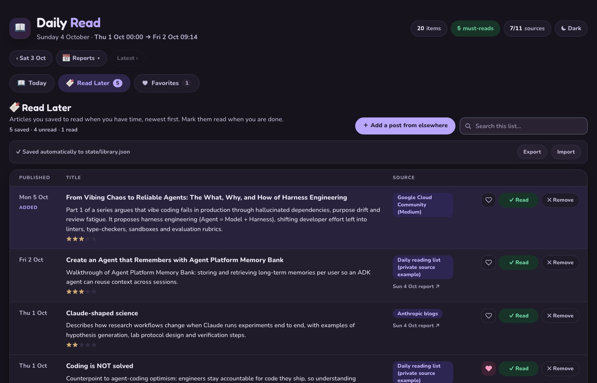
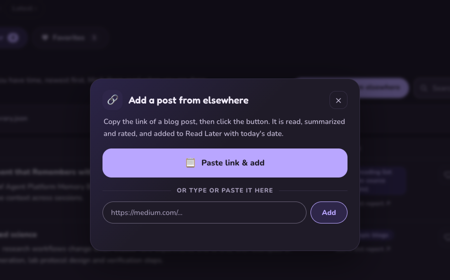
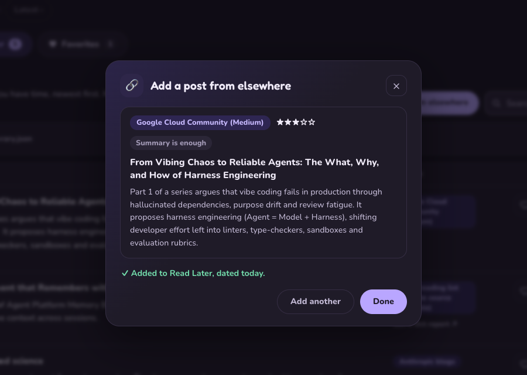
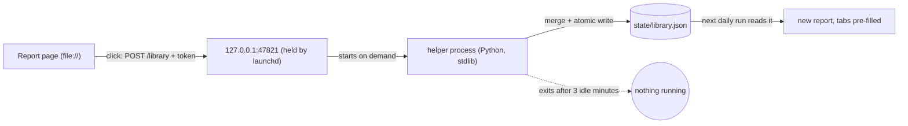
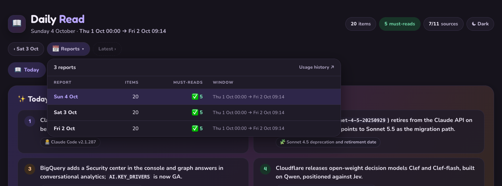
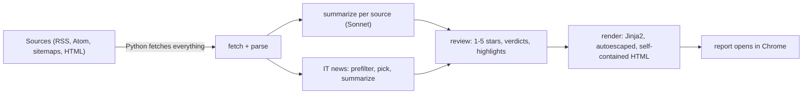

# Daily Read

A local, private daily reading digest. Every morning it fetches the sources you follow (release notes, blogs,
curated reading lists, IT news), has Claude write short neutral summaries and decide what is actually worth
reading in full, and opens a single self-contained HTML report in your browser.

- **Local-first**: Python fetches everything; Claude only sees the fetched text. No cloud service and no database (a tiny localhost helper only if you enable Read Later saving).
- **Runs on your Claude subscription** through headless Claude Code (`claude -p`). No API key needed (an `ANTHROPIC_API_KEY` in your environment is ignored).
- **Strict about your time**: every item gets 1–5★; only 4–5★ items are marked *Read fully*, with a daily budget
  of about 3 must-reads (enforced in code). Everything else is one 300-character summary.
- **One row per item**: each release note, version, post and reading-list link gets its own row.
- **Top IT news**: 5–10 deduplicated industry stories, at most 2 per company.
- **Read Later and Favorites**: a bookmark and a heart on every row, with two extra tabs that list what you saved; see [Read Later and Favorites](#read-later-and-favorites).
- **Add any link**: paste a blog link you found elsewhere (Medium included), and it is read, summarized, rated and added to Read Later; see [Add a post from elsewhere](#add-a-post-from-elsewhere).
- **Every past report**: previous/next buttons and a table of contents with item and must-read counts; see [Browsing past reports](#browsing-past-reports).


## Requirements

- macOS (report opening and the launchd automation are macOS-specific; the pipeline itself is plain Python)
- [uv](https://docs.astral.sh/uv/) (`brew install uv`, or `curl -LsSf https://astral.sh/uv/install.sh | sh`); it installs Python 3.12+ and the dependencies
- [Claude Code](https://code.claude.com/docs/en/overview) installed and logged in (`claude` on your `PATH`,
  default `~/.local/bin/claude`; change `claude.bin` in `config.yaml` otherwise)
- Google Chrome (or set `output.browser_app` in `config.yaml`)

## Log in to Claude (one time)

Daily Read doesn't call the Anthropic API directly. It runs **Claude Code in headless mode** (`claude -p`), so the
summaries and ratings come out of your normal Claude subscription and you don't need an API key.

1. Install Claude Code: `curl -fsSL https://claude.ai/install.sh | bash` (puts `claude` in `~/.local/bin`).
2. Start it once and log in: run `claude`, type `/login`, and sign in with your Claude account (a Pro or Max
   subscription, or a Team/Enterprise seat). Then exit with `/exit`.
3. Check that headless mode works: `claude -p "say ok"` should print `ok`.

Notes:
- A daily run makes about 13 Sonnet calls. They count against the same usage limits as your interactive Claude
  use. If you hit a session limit the run stops cleanly, nothing is lost, and the next run catches up.
- Claude runs locked down: no tools, no MCP servers, no settings from your projects. It only reads the fetched
  text and returns JSON (see [How it works](#how-it-works)).
- If you use several Claude accounts through `CLAUDE_CONFIG_DIR`, the run uses whichever config directory is set
  in its environment. `schedule install` copies it from your shell into the scheduled job.

## Quick start

```bash
git clone https://github.com/berkaybuharali/Daily-Read.git daily-read && cd daily-read
uv sync --group dev                          # create .venv and install dependencies
cp prompts/profile.example.md prompts/profile.md   # then edit it: who you are, what you follow
bin/dailyread mockup                         # see the design with sample data (no network, no Claude)
bin/dailyread run --dry-run -v               # full pipeline on real sources; doesn't touch real state; opens reports/dry-run/<date>_<time>.html
bin/dailyread run                            # your first real report (window starts at first_window_start in config.yaml)
bin/dailyread schedule install               # optional: one report a day, automatically (see Scheduling)
```

If `prompts/profile.md` doesn't exist, the example profile is used. `mockup` needs no Claude login. A dry run with a narrow `--since` on a quiet day can legitimately return 0 items.

## Commands

| Command | What it does |
|---|---|
| `bin/dailyread run --dry-run` | Full pipeline, window = yesterday 00:00 → now. Uses `state-dryrun/`, writes `reports/dry-run/` |
| `bin/dailyread run --dry-run --since 2026-10-01T00:00 --only gcloud_blog,bigquery_rn` | Narrower test run |
| `bin/dailyread run` | **Real run**: window = end of the previous report → now; archives the previous report, advances `state/` only if the run fully succeeds |
| `bin/dailyread render data/<file>.json` | Re-render a saved run after template/CSS changes (no Claude calls) |
| `bin/dailyread usage [--dry-run]` | Token usage history per run and stage |
| `bin/dailyread render --all` | Re-render every saved report (no Claude calls), e.g. after a template change |
| `bin/dailyread library status` | Show the library file path, how many items are saved and whether the helper token exists |
| `bin/dailyread mockup` | Render `fixtures/sample_report.json` |
| `bin/dailyread schedule install\|uninstall\|status` | Daily automation via launchd (see below) |
| `uv run --group dev pytest` | Unit tests (no network, no Claude) |
| `uv run --group dev --group ui pytest` | Same, plus browser UI tests that click through a report in Google Chrome (skipped if Chrome or Playwright is missing) |

Add `-v` for progress logs and `--no-open` to skip opening the browser. Logs go to `logs/<date>.log`.

## Where things end up

| Path | Contents |
|---|---|
| `reports/<date>.html` | Latest real report; older ones move to `reports/archive/<YYYY>/` |
| `reports/index.html` | History of reports, token usage per run, source health |
| `reports/dry-run/` | Dry-run reports (kept for comparison) and their own `index.html` |
| `data/reports/<date>.json` | Report data per real run (re-renderable); dry runs use `data/dry-run/` |
| `state/state.json` | Where the last real report ended (next window start) |
| `state/sources.json` | Per-source health and `covered_until` |
| `state/seen.json` | Item ids already reported (no repeats) |
| `state/runs.jsonl` | One line per run: duration, items, errors, tokens and cost per stage |
| `state/library.json` | Your Read Later and Favorites lists (written by the auto-save helper or the Chrome file link; git-ignored) |
| `state/library.token`, `state/library-backups/` | The helper's secret token; the last 14 daily copies of the library |
| `reports/catalog.js` | List of all reports, used by previous/next and the Reports menu |

## Scheduling on a Mac

Daily Read uses **launchd**, macOS's built-in scheduler. You don't need cron, a server, or to keep a terminal open.

```bash
bin/dailyread schedule install     # install and start the LaunchAgent
bin/dailyread schedule status      # is it loaded? last report, failures today, what the next check would do
bin/dailyread schedule uninstall   # stop and remove it
```

How it behaves:

- A LaunchAgent (`~/Library/LaunchAgents/com.dailyread.agent.plist`) runs a check at login and then every 30
  minutes (it also serves the Read Later helper, see [Where the lists are saved](#where-the-lists-are-saved-and-how-with-no-clicks)), plus calendar checks 5 minutes after the report time (07:05 by default) and at
  noon. macOS may show a one-time "background item added" notice. Timer ticks that fall while the Mac sleeps are skipped by launchd, so the calendar checks (which do fire once on wake)
  are the safety net: after a long sleep the report starts at the next check, at most about 30 minutes later.
- A check is instant when today's report already exists or it's before 07:00. So the report is made **the
  first time the Mac is on after 07:00**, once a day, and opens in Chrome.
- If the Mac is offline, or Claude says your usage limit is reached, the check just tries again 30 minutes later.
- A failed run doesn't advance state, so the next check retries. After **3 failed attempts in a day** you get a
  macOS notification, and it waits until tomorrow. Tomorrow's report then covers both days.
- The previous report moves to `reports/archive/<year>/`, and `reports/index.html` is updated.
- Settings (`not_before`, `interval_minutes`, `max_failures_per_day`) are in `config.yaml` → `schedule:`. Run
  `schedule install` again after changing them.
- Logs: `logs/<date>.log` (pipeline and scheduler) and `logs/launchd.log` (anything printed by the job).
- **Which Claude login:** the job uses the `CLAUDE_CONFIG_DIR` of the shell you ran `schedule install` from (the
  default `~/.claude` if it isn't set). `schedule install` prints which one.
- The Mac has to be on and logged in. launchd doesn't wake a sleeping Mac; the report is made at the first check after it is awake and you are logged in.

## Customising

Everything below needs no code changes.

- **Your interests**: `prompts/profile.md`. Changes verdicts, highlights and IT-news picks.
- **What earns a must-read**: `prompts/verdict_criteria.md` and `prompts/verdict_budget.md`.
- **Summary style**: `prompts/summary_rules.md`. **IT news selection**: `prompts/it_news_rules.md`.
- **Models / `effort` per stage, limits, retries**: `config.yaml`. As of 2026-10, Sonnet 5.5 always thinks adaptively, so `claude --effort`
  (low…max) is the cost/speed knob; judgement stages (IT pick, review) get more.
- **Sources**: `config.yaml` → `sections:`. List order is report and sidebar order (sections with nothing new
  that day move to the end).
  - Disable one: set `enabled: false`. When re-enabled it catches up from where it stopped (max 14 days).
  - Remove one: delete its section.
  - Reorder: move its section in the list.
  - Individual bloggers who post now and then go in one group, the `independent_writers` section: add
    `{name: "Jane Doe", url: "https://example.com/feed.xml"}` to its `writers:` list (no code). Each row shows the
    writer's name; use `fetch_pages: true` for feeds that only carry an excerpt.

## Adding a source

**The easy way, with Claude Code.** Open the project in Claude Code and say, for example:

> add https://example.com/blog, put it after BigQuery

[CLAUDE.md](CLAUDE.md) has a playbook it follows. It finds the feed (or a sitemap, or a dated HTML page), checks
dates and history depth, reuses an existing fetcher where possible, registers the source, adds the config section
in the right place, runs a test, and records quirks in the knowledge base. Say *"add it as a private source"* to
keep it out of git (see below).

**By hand.**

1. Find a feed: look for `<link rel="alternate" type="application/rss+xml">` in the page, or try `/feed/`,
   `/rss.xml`, `/atom.xml`, `/index.xml`. Check that entries have dates.
2. Pick a fetcher. Most blogs reuse the generic RSS/Atom one in `dailyread/sources/blog_feeds.py`:
   ```python
   def fetch_my_blog(ctx: Context) -> SourceResult:
       return _generic(ctx, url_filter=None, fetch_pages=True)   # fetch_pages: feed has only excerpts
   ```
   Google Cloud release-notes feeds need no code: reuse `gcp_release_notes.fetch`. GitHub releases: copy
   `claude_code.py`. No feed: see `anthropic_blogs.py` (sitemap) or `claude_platform.py` (dated HTML page).
3. Register it in `dailyread/sources/__init__.py` → `FETCHERS["my_blog"] = blog_feeds.fetch_my_blog`.
4. Add a section to `config.yaml` at the position you want:
   ```yaml
   - key: my_blog
     enabled: true
     title: My Blog
     short: "My Blog"        # sidebar label
     icon: "🦉"
     url: https://example.com/feed.xml
   ```
5. Test it: `bin/dailyread run --dry-run --only my_blog --since 2026-10-01T00:00 --no-open -v`.

## Source list

[SOURCES.md](SOURCES.md) is the **author's own reading list, published as an example** and kept up to date by the
author: what is built in, what is private, what is being evaluated (with posting cadence and a verdict) and what was
rejected. Borrow from it freely; it is not read by the program and is not your config.

## Read Later and Favorites

Every report has three tabs: **Today**, **Read Later** and **Favorites**.

- On each row in Today, the bookmark button saves it to Read Later and the heart adds it to Favorites. Click again
  to undo. The tab counters update at once.
- **Read Later** lists what you saved, newest article first, with the source as a column. Each row has **✓ Read**
  (dims it and moves it to the bottom), **✕ Remove**, a heart, and a link back to the daily report it came from.
  **Favorites** has the same columns.
- Both tabs have a search box. Each saved item keeps its title, link, source, publish date, stars and summary, so the
  lists are plain lookups: no Claude call, no network.



### Add a post from elsewhere

Found a good post that is not one of your sources (a share link, a newsletter, a chat)? On the Read Later tab, click
**＋ Add a post from elsewhere**. A small dialog opens:



1. Copy the post's link (the Share button of Medium and most sites gives one).
2. Click **📋 Paste link & add**. It reads your clipboard and starts at once. (The first time, Chrome may ask to allow
   reading the clipboard. You can also press ⌘V anywhere in the dialog, or type or paste into the box and press Enter.)
3. Wait while a seconds counter runs (usually 5 to 40 seconds, longer for slow sites). The dialog stays open and cannot be dismissed meanwhile.
4. A preview shows what was added. Click **Done**, and the new row is highlighted in the list; or **Add another**.



Behind the scenes:

1. The link is cleaned: tracking parameters (`utm_*`, `source=`, `fbclid` and similar) are removed, and a message pasted
   around the link is fine. A Medium *friend link* keeps its `sk=` token, so it still opens.
2. The page is read. A plain fetch comes first. Sites that block scripts (Medium answers with a Cloudflare block page)
   are opened with the **Google Chrome you already have**, headless, in a throwaway profile that is deleted right
   after. No third-party reader, proxy or archive is used.
3. Claude (one call, same locked-down rules as the daily digest: no tools, the page text only as data) writes a clean
   title, **derives the source** (for a Medium story the publication, e.g. "Google Cloud Community (Medium)"; for a
   personal blog the blog name), writes the summary, and rates it 1 to 5 stars with the same rules and your
   `prompts/profile.md` as the daily review (4 to 5 stars = "Read fully").
4. The row appears **at the top**. Its date is the day you **added** it, not the post date, and it carries a small
   "ADDED" tag. Add the same link again and you get "Already in your Read Later list" (a favorite stays a favorite).

What it does not add, always with a plain reason and nothing saved:

| You see | Why |
|---|---|
| "This is a member-only story: it needs a login…" | Medium paywall: only a preview is public |
| "The page asks you to sign in to read it…" | Login wall |
| "The site blocked automatic reading (bot check)…" | Cloudflare or similar, even for Chrome |
| "Not enough readable text on that page…" | A video, a listing or an app page |
| "That address is on your own computer or network…" | Safety rule: only public websites; your router, `localhost` and cloud-metadata addresses are refused, including after redirects |
| "Your Claude usage limit is reached…" | Try again later |

Other refusals are plain sentences ending in "Nothing was added." (timeout, too many redirects, not a web page, address not found, only ports 80/443, Chrome not found). The full list is in `dailyread/add_link.py`.

Good to know:

- It needs the auto-save helper (`bin/dailyread schedule install`), because reading and summarizing happen in Python,
  not in the page. Without the helper the dialog opens but is switched off and says how to enable it.
- One link is processed at a time. While it runs, the helper (about 30 MB) briefly starts Chrome and Claude; when
  you stop clicking it exits after 3 idle minutes. One link costs one Sonnet call.
- Settings are in `config.yaml` under `add_link:` (timeouts, minimum words, Chrome path) and `claude: models/effort:
  add_link`. The task prompt is `prompts/stages/add_link.md`.
- Privacy: the page's text is sent to Claude (as the daily digest does for articles). Only paste public pages you
  are happy to have summarized. A link keeps its query string (some links carry a private token): it is saved in
  `state/library.json` and in the reports you render, so do not share those.
- A hostile page can only bias what Claude says about it (a flattering rating, a misleading title or source name);
  the answer is size-limited by a schema and shown as plain text, and Claude has no tools to misuse.

**How it stays safe** (covered by the test suite, see [SECURITY.md](SECURITY.md)): every connection, from the plain fetch and
from Chrome (redirects, frames, images, scripts), goes through a small filtering proxy that lives only for that one add.
It resolves the name itself, refuses anything that is not a public website (your router, `localhost`, cloud metadata,
IPv6 tricks), and connects to the exact address it checked, so DNS tricks cannot swap it. Chrome runs at low priority,
without extensions, with a throwaway profile, no access to your downloads folder and a minimal environment, and is
killed afterwards; leftover profiles are swept. The plain fetch never decompresses a page, and the size is capped, and at most
about 1 MB and 25,000 elements of a page are parsed, so a hostile page cannot use up your memory or CPU.

### Where the lists are saved (and how, with no clicks)

A report is a static HTML file, and a web page cannot write to your disk by itself. So Daily Read has a tiny local
helper, and your lists end up in one plain file, **`state/library.json`** (git-ignored, next to the other state files).



1. `bin/dailyread schedule install` (the same command that installs the daily schedule) creates a secret token in
   `state/library.token` and tells launchd to listen on `127.0.0.1:47821`. It then runs a self-test; if the helper
   fails it, the helper is **not** enabled and nothing is left listening.
2. When you click a button (or open a report), launchd starts the helper, which saves the change to the file and answers.
   Browser storage keeps a copy too, so the lists work even if the helper is unreachable.
3. After **3 minutes without a request** the helper exits. launchd keeps the port, so the next click starts it again
   (about 0.4 s). Nothing runs between clicks.
4. The helper is the only thing that writes the file (atomically, owner-only). The report renderer only reads it, to
   pre-fill the tabs, and every successful real run copies it to `state/library-backups/library-<date>.json` (last 14 kept).

**One LaunchAgent, two triggers.** The `com.dailyread.agent` job that makes your daily report is the same job that
owns the port. It is registered permanently but is not a running program: launchd starts it every 30 minutes for
about a second (the daily check), and when a report page connects (the helper). While a report is being generated, the
helper keeps serving from a background thread, so a click never waits for the pipeline.

**What it costs** (measured on a Mac, macOS 26): no process and 0 MB when idle; a cold start answers in about 0.4 s
using about 30 MB and a fraction of a CPU-second; the job runs at background priority. The idle-time and port are in
`config.yaml` → `library:`.

**Security model.** The helper listens on `127.0.0.1` only, and every request needs the secret token (compared in constant
time). It also checks the `Host` header (DNS rebinding), accepts only the `Origin: null` that pages opened from disk
send, limits body size, validates every record, writes atomically with owner-only permissions, and moves a damaged file
aside instead of overwriting it. Reports carry a Content-Security-Policy that allows no network access except the
helper. Titles and summaries from feeds are untrusted: the lists render them as plain text and only open `http(s)`
links. The token is embedded in the reports you render, so **do not publish or share your reports** (they are
git-ignored). On a Mac with several user accounts, loopback is shared between accounts, so the token is the only barrier.

**Without the helper** (not installed, or a browser that cannot reach it): clicks still save in the browser, a reminder
bar appears, and you can **Export** / **Import** the lists as JSON. In Chrome/Edge a **Link library file** button lets
the page write `state/library.json` itself (one picker click, Chrome may ask to reconnect now and then). Firefox and
Safari restrict storage for local files, so there use Export and Import, or Chrome.

**Check after Chrome updates.** Chrome has been tightening what pages may do towards local addresses (Local Network
Access). Pages opened from disk are exempt today (verified in stock Chrome 154). To re-check any time:
`uv run --group dev --group ui pytest tests/test_stock_chrome.py -v`. If it ever fails, reports fall back to browser
storage with the reminder bar; nothing is lost.

**Check, uninstall, upgrade.** `bin/dailyread schedule status` shows whether the job is loaded, how often launchd has run it,
the helper token, and any problem (for example the project folder moved, the Python environment was rebuilt, or the job
was installed before the helper existed). In those cases run `bin/dailyread schedule install` again; it is safe to repeat,
but it waits if a report is being generated. `bin/dailyread schedule uninstall` removes the job, the port and the token;
your `state/library.json` stays. If port 47821 is taken by another program, install keeps the daily schedule, skips
the helper and tells you; change `library: port:` in `config.yaml` and install again.

### Moving to a new laptop

The file is the master copy, so your lists are not tied to a browser:

1. Install the tools and [log in to Claude](#log-in-to-claude-one-time) on the new Mac.
2. Copy the project's git-ignored personal files: `state/` (this includes `library.json` and the helper token, so older
   reports keep working), `prompts/profile.md`, `config.local.yaml`, `local_sources/`, `CLAUDE.local.md`, and **both**
   `data/` and `reports/` if you want the history (copy both or neither: navigation and re-rendering need the data).
   Do not copy `.venv`.
3. `uv sync`, then, from the shell that is logged in to the Claude account you want, `bin/dailyread schedule install`
   (it records that shell's `CLAUDE_CONFIG_DIR`). If it is after the report time and today's report is missing, the first
   check runs right away; that is expected.
4. Run `bin/dailyread render --all` (no Claude call) or wait for the next daily run. Your saved items are baked into
   the reports, so Read Later and Favorites are restored.

- The file is `{"version": 1, "items": {"<id>": {title, url, source, published, report, stars, summary, read_later,
  favorite, read, updated_at, ...}}}`. Removing an item keeps a small record with both flags off so the removal wins a
  merge between the browser and the file (newest change per item wins).

## Browsing past reports

Every report is kept: today's in `reports/`, older ones in `reports/archive/<year>/`, and the data behind each one in
`data/reports/<date>.json` (so any report can be re-rendered without a Claude call).

- Each report has a bar with **‹ previous**, **next ›** and a **📅 Reports** menu: a table of contents of every report
  with its date, how many items it has, how many must-reads, and its time window. Click a row to open it.



- Saved items show **"Sat 3 Oct report ↗"**, which opens that day's report scrolled to the exact row.
- `reports/catalog.js` lists all reports and is rewritten on every run, so navigation is always current. Only the
  report that gets archived is re-rendered. After a template change, `bin/dailyread render --all` rebuilds every report.

## Private sources

Some sources you may want to keep to yourself. Daily Read loads two git-ignored places on top of the public setup:

- **`config.local.yaml`** is merged over `config.yaml`. A section with a new key is added at `position: first`,
  `after: <key>`, `before: <key>`, or at the end. A section with an existing key overrides its fields, for
  example to turn off a public source just for you:
  ```yaml
  sections:
    - key: my_private_list
      position: first
      title: My private reading list
      short: "Private list"
      icon: "🔒"
      url: https://example.com/private/feed.xml
    - key: sre_weekly
      enabled: false
  ```
- **`local_sources/*.py`**: private fetchers, loaded automatically. Each module defines
  `FETCHERS = {"<key>": fetch}`. Start from `local_sources/example_source.py`.

## How it works



> [!IMPORTANT]
> **Claude never browses.** Python fetches all web content. Claude runs headless with no tools
> (`--tools ""`, `--strict-mcp-config`, `--setting-sources ""`), receives untrusted text only as data on stdin, and must
> answer in a JSON schema. The model never produces HTML. State advances only after a fully successful real run.

Details in [CLAUDE.md](CLAUDE.md) (the maintainer playbook) and [PLAN.md](PLAN.md) (the original design record).

## Cost

A typical daily run makes about 13 Claude calls (roughly 90k to 155k input tokens, depending on how many days the window covers) and takes 1–2 minutes. It uses
your Claude subscription allowance; `bin/dailyread usage` shows the history. Its "≈$" columns are list-price estimates, not a bill.

## Limitations

- Automation is macOS-only (launchd); the pipeline itself is plain Python. Chrome is the primary browser.
- It is a one-person project with an opinionated profile (`prompts/profile.md`) and English-language sources.
- Everything is bounded by your Claude subscription limits.

## Troubleshooting

- **`claude: command not found` in a scheduled run**: set `claude.bin` in `config.yaml` to the full path.
- **The report did not open**: check `bin/dailyread schedule status` and `logs/<date>.log`; set `output.browser_app` if you do not use Chrome.
- **`schedule status` says PROBLEM**: the project folder moved or the Python environment was rebuilt; run `schedule install` again.
- **Port 47821 is taken**: see "Check, uninstall, upgrade" above; change `library: port:` and install again.
- **A section is empty**: the window may simply have no news; a source's `covered_until` in `state/sources.json` shows where it stopped.
- **Usage limit reached**: the run stops cleanly and the next check catches up.

## Uninstall

`bin/dailyread schedule uninstall` removes the LaunchAgent, the port and the token. Then delete the project folder; your
reports and lists live inside it (`reports/`, `state/`), so copy what you want to keep first.

## Third-party notices

- Fonts **Nunito** and **Fredoka**: SIL Open Font License 1.1 (`templates/vendor/OFL.txt`), embedded in the report.
- The heart, bookmark and search icons are from **Feather** icons, MIT licence, Copyright (c) 2013-2023 Cole Bemis.
- Python dependencies are listed in `pyproject.toml` / `uv.lock`; each keeps its own licence.

## Licence

[MIT](LICENSE).
